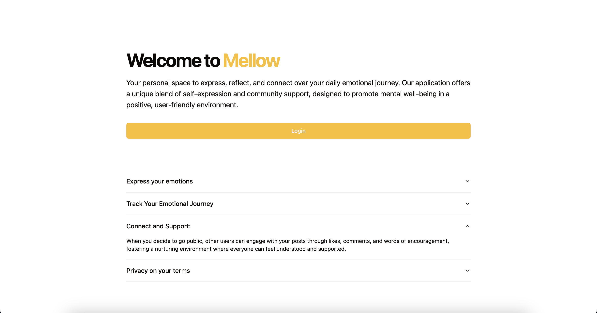
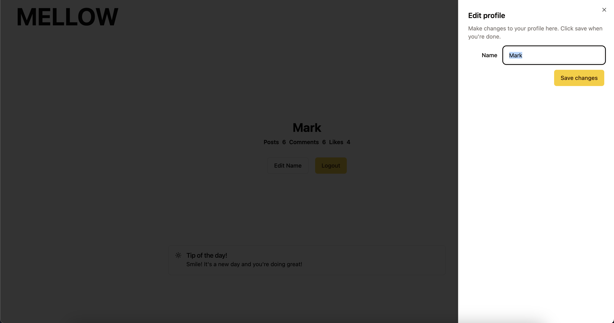
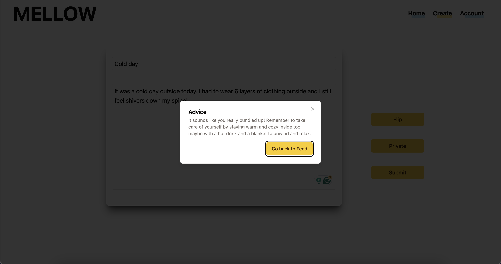

# Mellow: A Comprehensive Mental Health Journal App

## Problem Statement

In the landscape of existing mental health journal applications, there's a noticeable gap. Many apps do not offer a holistic user experience, lacking crucial elements like mental health tips and interactive community features. Users often find themselves isolated, missing out on the potential benefits of shared experiences and support in their mental health journey.

## Our Solution: Mellow

**Mellow** steps in as an all-encompassing mental health journal app designed to fill the existing gaps. Our solution integrates several key features to provide users with a comprehensive and interactive platform for mental health journaling:

* **Thought and Emotion Journaling:** At its core, Mellow provides a user-friendly interface for individuals to document their thoughts and emotions, fostering a habit of self-reflection and awareness.

* **AI-Powered Mental Health Tips:** Leveraging advanced AI, Mellow offers personalized mental health tips, guiding users towards positive practices and insights into their mental well-being.

* **Community Connection:** Understanding the importance of shared experiences and support, Mellow includes a community feature where users can leave comments, share insights, and offer encouragement, thereby fostering a supportive environment.

## Technologies Used

Our team has chosen a robust stack to bring Mellow to life, ensuring reliability, user-friendliness, and scalability:

* **Frontend:**
  + **React:** A powerful JavaScript library for building user interfaces, known for its efficiency and flexibility.
  + **Next.js:** A React framework that enables functionalities such as server-side rendering and generating static websites, enhancing performance and user experience.
  + **Tailwind:** A utility-first CSS framework that allows for rapid UI development without leaving your HTML.
  + **MUI:** A popular React UI framework offering a comprehensive collection of components and tools for efficient design.
  + **ShadCn UI:** An innovative UI toolkit designed for React, bringing a fresh perspective to interface design.

* **Backend:**
  + **Node.js:** A JavaScript runtime built on Chrome's V8 engine, ideal for building fast and scalable network applications.
  + **Express.js:** A minimal and flexible Node.js web application framework, providing a robust set of features for web and mobile applications.
  + **MongoDB:** A powerful, document-based database designed for ease of development and scaling.

## Screenshots

  **Landing page**
  

  **Profile screen**
  

  **Submitting a journal entry**
  

  **My journals screen**
  

  **Comment section**
  

## Team 1: The Minds Behind Mellow

* **Mark**
* **Connor**
* **Simrat** 
* **Gagan** 
* **Ashkan** 

---

Join us in revolutionizing mental health journaling with Mellow, where your thoughts, emotions, and connections flourish in a supportive and interactive environment.
